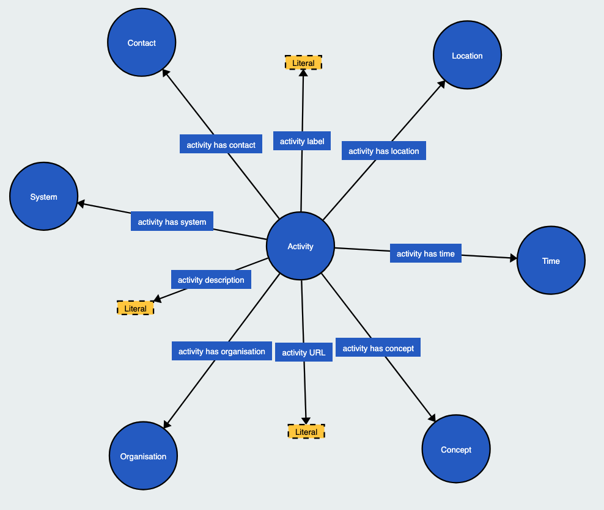
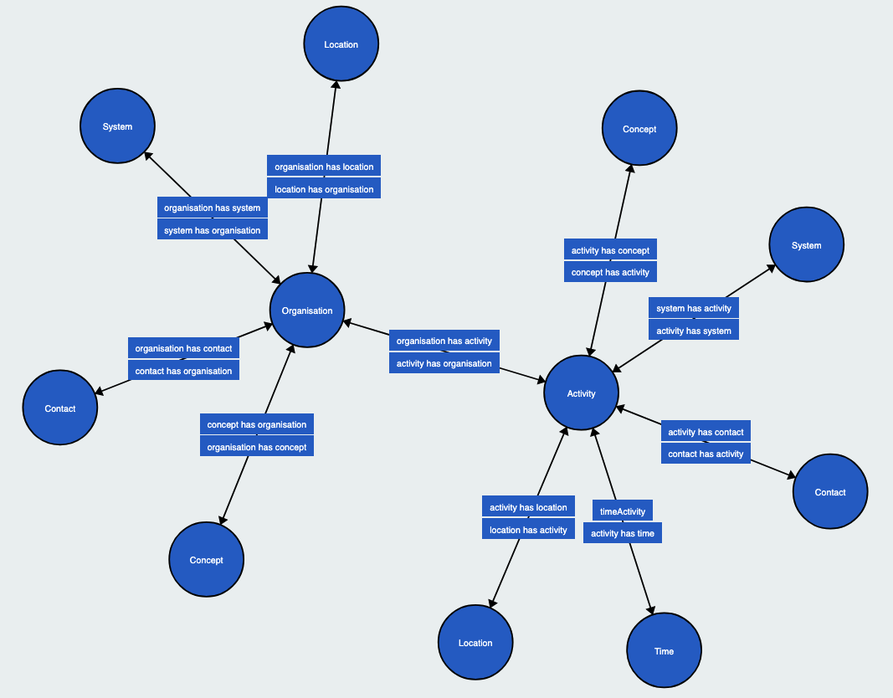
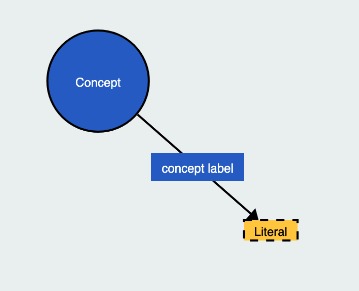
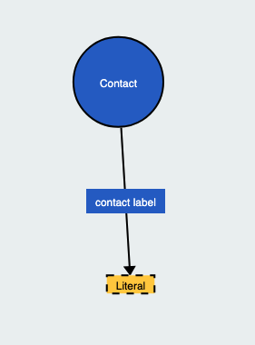
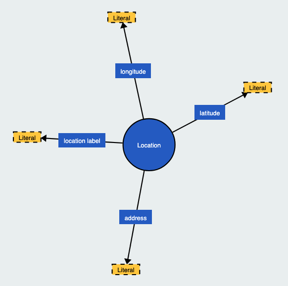
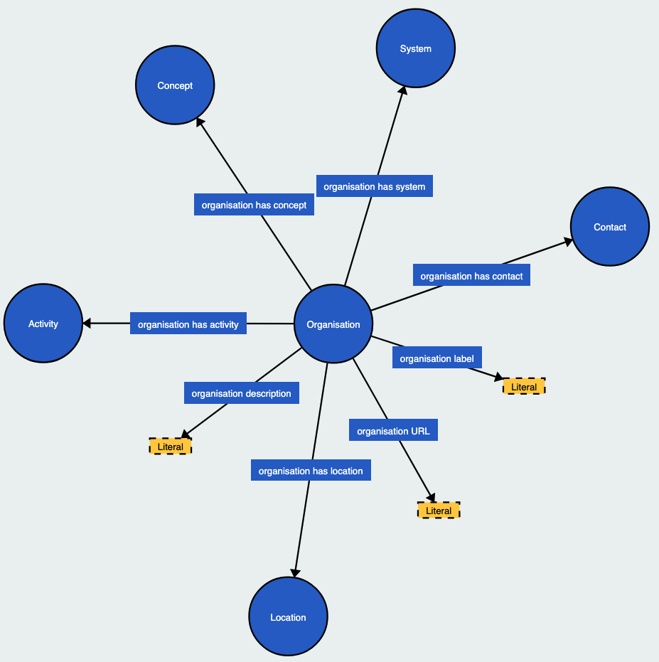
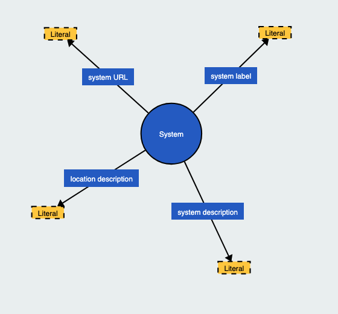
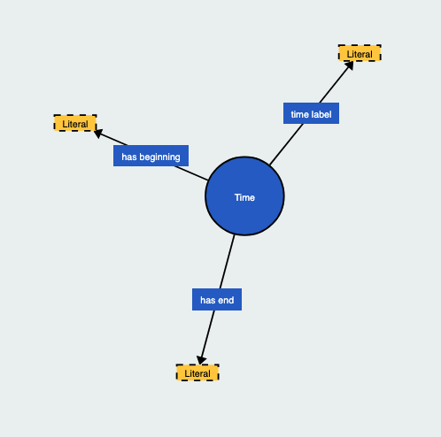

This directory holds snapshots of the volunteering data model.

Images have been generated using the [WebVOWL](https://github.com/VisualDataWeb/WebVOWL) ontology visualisation tool.

Each version also corresponds to a tagged git commit.

## Version 1

Basic modelling of volunteer-involving organisations and volunteering activities ([v1](https://github.com/openvolunteering/data-model/tree/v1)).

### Activity

### Classes

### Concept

### Contact

### Location

### Organisation

### System

### Time

## Version 2

Incorporate feedback from the first Volunteering Standards Working Group session held on the 14th of November 2025 ([v2](https://github.com/openvolunteering/data-model/tree/v2)).

### Activity

### Organisation

### Taxonomy

